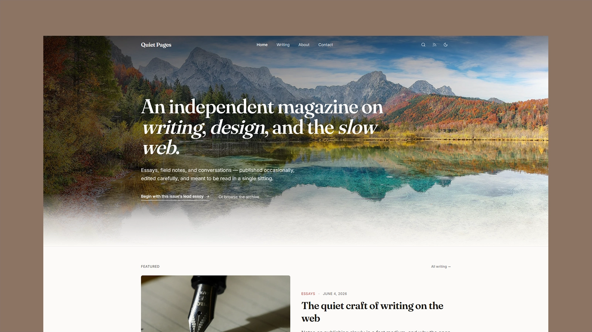

# QuietPages - Astro Magazine Theme

[](https://quietpages-eta.vercel.app/)


Preview: [quietpages-eta.vercel.app](https://quietpages-eta.vercel.app/)

QuietPages is a calm Astro theme for independent magazines, personal journals, and long-form editorial sites. It keeps the reading experience simple and fast while including the pieces a production-ready publication needs: archives, taxonomy pages, author pages, RSS, sitemap, structured metadata, and self-hosted fonts.

## Features

- Editorial homepage with a full-bleed visual lead story
- Blog archive with search, category filters, tag filters, and load-more pagination
- MDX blog posts powered by Astro content collections
- Category, tag, and author index pages
- Article pages with breadcrumbs, table of contents, sharing actions, related posts, and adjacent navigation
- RSS feed, XML sitemap, and dynamic robots.txt
- Canonical URLs, Open Graph tags, Twitter card metadata, and article JSON-LD
- Light and dark modes with system preference support
- Self-hosted Inter, Fraunces, and JetBrains Mono fonts
- Accessible landmarks, visible focus states, skip link, and reduced-motion handling
- Responsive images through Astro's image pipeline
- Contact page and custom 404 page

## Tech Stack

- Astro 6
- Tailwind CSS 4 via the Vite plugin
- MDX
- Astro content collections
- Self-hosted `woff2` fonts

## Getting Started

Install dependencies:

```bash
npm install
```

Start the development server:

```bash
npm run dev
```

Build for production:

```bash
npm run build
```

Preview the production build locally:

```bash
npm run preview
```

## Theme Setup

The main theme settings live in [`src/lib/blog-data.js`](./src/lib/blog-data.js):

- `SITE.name`
- `SITE.description`
- `SITE.url`
- navigation-adjacent data such as authors, categories, and tags

Set your production URL before deploying:

```bash
SITE_URL=https://your-domain.com
```

You can also use:

```bash
PUBLIC_SITE_URL=https://your-domain.com
```

This keeps canonical URLs, Open Graph URLs, RSS links, robots.txt, and the sitemap aligned with the deployed domain.

## Content

Blog posts live in [`src/content/blog`](./src/content/blog). Each post uses an `index.mdx` file inside its own folder, with local images stored beside the content.

Required frontmatter is validated in [`src/content.config.js`](./src/content.config.js):

- `title`
- `excerpt`
- `date`
- `readingTime`
- `category`
- `tags`
- `author`
- `thumbnail`

## SEO

QuietPages includes:

- unique page titles and descriptions
- canonical URLs generated from the configured site URL
- Open Graph and Twitter card metadata
- article JSON-LD on post pages
- XML sitemap at `/sitemap.xml`
- RSS feed at `/rss.xml`
- robots.txt with a sitemap reference

Main SEO files:

- [`src/layouts/BaseLayout.astro`](./src/layouts/BaseLayout.astro)
- [`src/pages/sitemap.xml.js`](./src/pages/sitemap.xml.js)
- [`src/pages/robots.txt.js`](./src/pages/robots.txt.js)
- [`src/pages/rss.xml.js`](./src/pages/rss.xml.js)

## Images and Assets

The repository includes [`preview.webp`](./preview.webp) for the README preview. Content images live beside each MDX post, and shared theme assets live in [`src/assets`](./src/assets).

Fonts are self-hosted in [`public/fonts`](./public/fonts). Replace those files and the `@font-face` declarations in [`src/styles.css`](./src/styles.css) if you want a different type system.

## Customization

- Edit theme colors, typography tokens, radii, and prose styles in [`src/styles.css`](./src/styles.css).
- Update authors, categories, tags, and site defaults in [`src/lib/blog-data.js`](./src/lib/blog-data.js).
- Add or remove navigation items in [`src/components/Header.astro`](./src/components/Header.astro) and [`src/components/Footer.astro`](./src/components/Footer.astro).
- Replace example posts in [`src/content/blog`](./src/content/blog) with your own MDX content.

## Deployment

QuietPages works anywhere Astro can deploy. For Vercel, Netlify, or another static host, set `SITE_URL` to the production domain before building so metadata and feeds use absolute URLs.

## License

This project is licensed under the [MIT License](./LICENSE).
